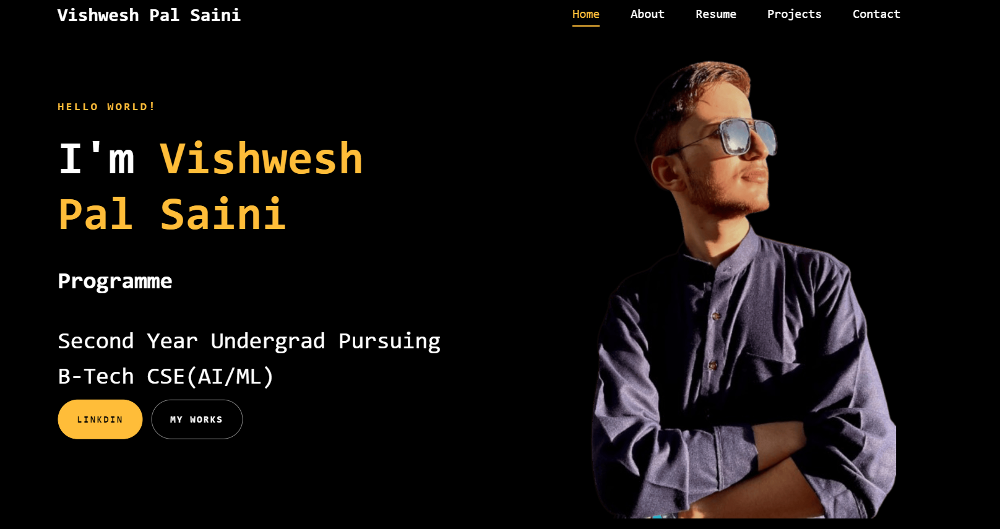

# Vishwesh Pal Saini - Personal Portfolio



Welcome to my personal portfolio website! This is a space where I showcase my projects, resume, and other key highlights of my journey as a Computer Science undergraduate specializing in AI/ML.

## 🌟 Introduction
Hello, I'm **Vishwesh Pal Saini**, a second-year B-Tech student majoring in CSE with a specialization in AI/ML. This portfolio is a reflection of my passion for technology and development.

The website is designed to give an overview of who I am, my skillset, and the projects I have worked on, providing potential collaborators and employers with a quick insight into my work.

## 🚀 Features
- **Responsive Design**: Fully responsive, ensuring a great viewing experience on all devices.
- **Projects Showcase**: Displays a portfolio of my key projects, including live demos and GitHub links.
- **Smooth Animations**: Elegant animations to improve user experience.
- **Resume Section**: A downloadable resume with all my details.
- **Contact Form**: A direct way to reach out to me.

## 🛠️ Technologies Used
- **HTML5** for structuring the content.
- **CSS3** for designing the layout and adding styles.
- **JavaScript** for interactive elements.
- **Font Awesome** for icons.
- **Google Fonts** for typography.
- **Bootstrap** for responsiveness and styling.
- **AOS.js** for smooth animations.
- **Owl Carousel** for interactive project showcases.

## 🖥️ Website Sections
- **Home**: A simple introduction to who I am.
- **About**: Details about my academic background and skills.
- **Resume**: An embedded section with my qualifications and work experience.
- **Projects**: Showcasing my technical projects with GitHub links and live previews.
- **Contact**: A form to connect with me via email.

## 📸 Screenshot


## 📂 Folder Structure
```bash
.
├── css/                   # Stylesheets
├── js/                    # JavaScript files
├── img/                   # Images and icons
├── index.html             # Main HTML file
└── README.md              # This README file
